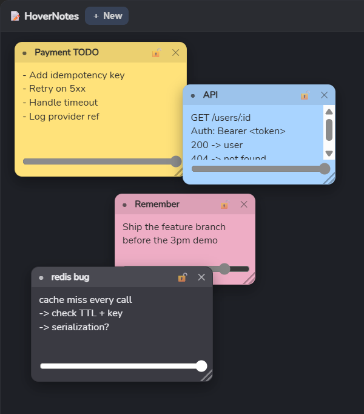
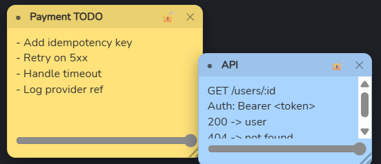

<div align="center">

# 📝 HoverNotes

### Sticky notes that float above everything you do.

A lightweight, always-on-top notes board that stays visible over VS Code, your
browser, your terminal — whatever has focus. Local-first, keyboard-friendly, and
tiny (~11 MB).

<br/>



<br/>


</div>

---

## ✨ Features

- 🪟 **Always on top** — the board floats above other apps, even when they have focus.
- 🎨 **Five themes** — yellow, blue, green, pink, and dark. One click cycles them.
- 🖱️ **Drag & resize** — grab a note by its header to move it, pull the corner to resize. Smooth, no jank.
- 🫥 **Per-note opacity** — fade a note back to 40% so it stays as quiet reference material.
- 🔒 **Lock** — freeze a note so you can't move, resize, or edit it by accident.
- 💾 **Auto-save & restore** — every edit is persisted (debounced, atomic) and your notes come back exactly where you left them.
- 🔔 **System tray** — closing the window hides to the tray; the app keeps running in the background.
- ⌨️ **Global hotkeys** — create a note or toggle the board from *any* app.
- 🔌 **100% offline** — zero network calls, zero accounts. Your notes never leave your machine.

<div align="center">
<br/>



<sub>Each note has a color dot, title, lock, close, an opacity slider, and a resize grip.</sub>

</div>

---

## ⌨️ Keyboard & tray

| Action | Shortcut | Scope |
|---|---|---|
| New note | `Ctrl + Alt + N` | **Global** — works from any app |
| Show / hide the board | `Ctrl + Alt + H` | **Global** |
| New note | `Ctrl / Cmd + Shift + N` | While the board is focused |
| Change color | `●` on the note | — |
| Lock / unlock | `🔒` on the note | — |

> `Ctrl + Alt + N` is used instead of `Ctrl + Shift + N` on purpose — the latter
> is Chrome/Edge's "New Incognito Window."

**System tray menu:** New Note · Show All · Hide All · Quit.
Left-click the tray icon to toggle the board. The window's **✕ hides to the
tray** — quit for real from the tray menu.

---

## 🚀 Getting started

### Prerequisites

- [Go](https://go.dev/dl/) 1.25+
- [Node.js](https://nodejs.org/) 18+
- [Wails CLI](https://wails.io/) v2 — `go install github.com/wailsapp/wails/v2/cmd/wails@latest`
- WebView2 runtime (preinstalled on Windows 11)

> **No Rust required** — unlike Tauri, this app's native layer is Go.

### Run in development (hot reload)

```bash
export PATH="$PATH:$(go env GOPATH)/bin"
wails dev
```

### Build a release binary

```bash
export PATH="$PATH:$(go env GOPATH)/bin"
wails build          # → build/bin/hover-notes-spike.exe  (~11 MB)
```

---

## 🏗️ Architecture

HoverNotes is a single **Wails v2** window (the "board") with a React UI. The Go
side owns the OS and the disk; React owns the notes. They talk over Wails' IPC
bridge — React never touches the OS directly (the *WindowService* seam).

```
┌─────────────────────────────┐        ┌──────────────────────────────┐
│          React / TS         │        │             Go               │
│                             │        │                              │
│  App.tsx     board + z-order│        │  app.go      JSON persistence │
│  Note.tsx    drag/resize/edit│  IPC   │              window controls  │
│  useNotes    load + autosave│◄──────►│  desktop.go  tray + hotkeys   │
│                             │ events │              new-note signal  │
└─────────────────────────────┘        └──────────────────────────────┘
```

| Layer | Key files |
|---|---|
| UI | `frontend/src/App.tsx`, `frontend/src/components/Note.tsx` |
| State & persistence hook | `frontend/src/hooks/useNotes.ts` |
| Data model | `frontend/src/types/note.ts` · `app.go` |
| Native (window, storage) | `app.go` |
| Tray & global hotkeys | `desktop.go` |

**Smooth dragging:** while you drag or resize, the moving geometry lives in local
component state, so only the card you're touching re-renders — the store and disk
are written once, on release.

### Data

Notes are stored at `%APPDATA%\HoverNotes\notes.json`:

```json
{
  "version": 1,
  "notes": [
    {
      "id": "note_01",
      "title": "redis bug",
      "content": "Check cache miss handling",
      "position": { "x": 910, "y": 180 },
      "size": { "width": 320, "height": 260 },
      "appearance": { "opacity": 0.9, "theme": "yellow" },
      "behavior": { "alwaysOnTop": true, "clickThrough": false, "locked": false },
      "createdAt": 1787020000000,
      "updatedAt": 1787021000000
    }
  ]
}
```

Writes are **atomic** (temp file + rename); a corrupt file is backed up and
replaced with a clean one, so a bad write never costs you the app.

The full design doc lives in
[`HOVERNOTES_ARCHITECTURE_REQUIREMENTS.md`](HOVERNOTES_ARCHITECTURE_REQUIREMENTS.md).

---

## 🧭 Why a "board", and what's next

The original design imagined every note as its own OS window scattered across the
desktop, with clicks passing through the gaps. **Wails v2 is single-window and has
no OS-level click-through**, so all notes live as cards inside one floating board.
True desktop-scattered notes would need Wails v3 (alpha) or native Win32.

**Roadmap**

- [ ] Search across notes (`Ctrl + Shift + F`)
- [ ] Multi-monitor startup safety (pull the board back onto a visible screen)
- [ ] Settings panel (default theme, configurable shortcuts)
- [ ] Markdown rendering
- [ ] Desktop-scattered windows + per-note click-through *(needs Wails v3 / Win32)*

---

<div align="center">
<sub>Built with Go · Wails · React. Local-first, always on top.</sub>
</div>
